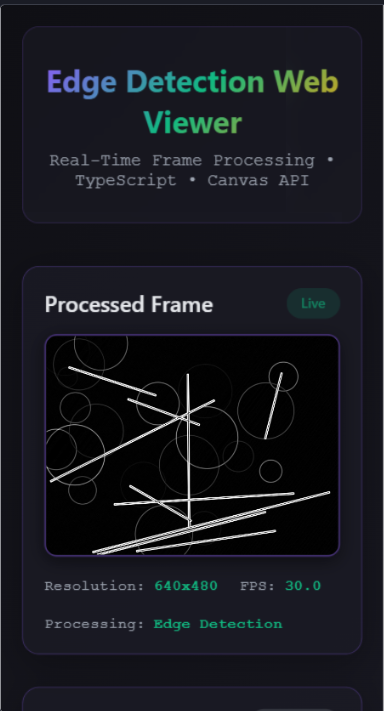

#  Edge Detector

A lightweight Android app that performs real-time **edge detection** using **OpenCV**.  
It integrates **Kotlin** for UI logic and **C++ (JNI)** for high-performance image processing.

---

##  Features

-  Real-time edge detection using OpenCV  
-  Native library integration with JNI (C++)  
-  Clean modular structure (Kotlin + C++)  
-  Simple and intuitive UI  
-  Gradle-based build configuration  

---

##  Project Structure

```
Edge-Detector/
│
├── app/                         # Main Android app module
│   ├── src/
│   │   └── main/
│   │       ├── java/com/example/edge_detector/
│   │       ├── cpp/
│   │       └── res/
│   └── build.gradle
│
├── jniLibs/                     # Precompiled OpenCV native libraries
├── docs/                        # Documentation and sample images
├── gradle/                      # Gradle build configuration
├── build.gradle                 # Root build configuration
├── settings.gradle              # Gradle settings
└── README.md                    # Project documentation
```

---

##  Tech Stack

| Technology | Purpose |
|-------------|----------|
| **Kotlin** | Android app logic and UI |
| **OpenCV** | Image processing and edge detection |
| **JNI / C++** | Native library integration |
| **Gradle** | Build and dependency management |

---

##  Setup Instructions

### 1. Clone the Repository
```bash
git clone https://github.com/AnshulSharma2005/Edge-Detector.git
cd Edge-Detector
```

### 2. Open in Android Studio
Open **Android Studio** → **Open an existing project** → Select **Edge-Detector**

Wait for **Gradle sync** to complete.

---

### 3. Add OpenCV SDK (if not included)

Place the **OpenCV SDK** in your local directory if missing.  
Update `local.properties` with your SDK path if necessary:

```bash
sdk.dir=C:\Users\Anshul\AppData\Local\Android\Sdk
```

---

### 4. Build and Run

Connect your Android device or use an emulator.  
Click **Run** ▶️ in Android Studio.

---

##  Sample Output

###  Input vs Edge Detection Result

| Original Image | Edge Detected Output |
|----------------|----------------------|
|  |  |

---

### Real-time Detection Preview

https://github.com/AnshulSharma2005/Edge-Detector/blob/main/docs/output.gif.mp4

---

📸 **Description:**
The app captures real-time frames using the device camera and applies **OpenCV’s Canny Edge Detection** to highlight object boundaries dynamically.  
The above video demonstrates live edge extraction from the camera feed — showing detection accuracy and performance.


---

##  Contributing

1. Fork the repository  
2. Create a new branch:  
   ```bash
   git checkout -b feature-name
   ```
3. Commit your changes:  
   ```bash
   git commit -m "Add feature-name"
   ```
4. Push to your branch and open a **Pull Request**

---

##  License
This project is licensed under the **MIT License** — feel free to use and modify it.

---

> Developed with by [Anshul Sharma](https://github.com/AnshulSharma2005)
